

  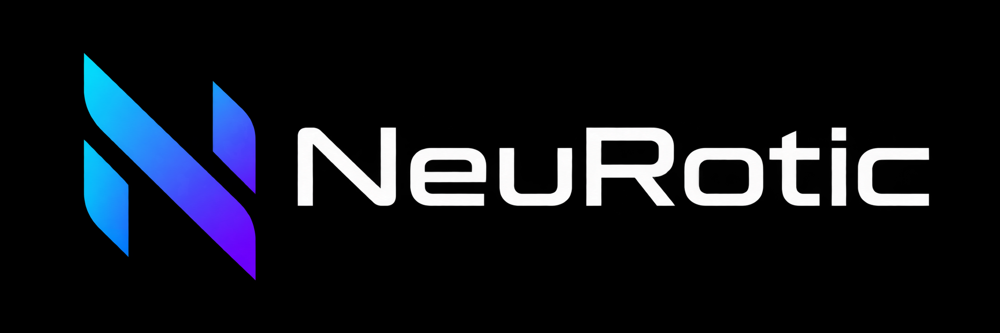

# NeuRotic

## An OptiScaler DLSS-NR fork

NeuRotic is a Windows application and rendering middleware built on [OptiScaler](https://github.com/optiscaler/OptiScaler) and [Dagherbou's OptiScaler DLSS-NR fork](https://github.com/Dagherbou/OptiScaler_DLSSNR). It provides neural rendering, in-game rendering controls, and desktop window processing, with an App for game discovery, installation, configuration, and diagnostics.

## Table of Contents

- [What NeuRotic Does](#what-neurotic-does)
- [Latest Release: Alpha 0.9.7](#latest-release-alpha-097)
- [An Interface Designed for Easy Access](#an-interface-designed-for-easy-access)
- [Workflows](#workflows)
- [Compatibility](#compatibility)
- [Current Status and Roadmap](#current-status-and-roadmap)
- [Installation](#installation)
- [Uninstallation](#uninstallation)
- [Help Shape NeuRotic](#help-shape-neurotic)
- [Support NeuRotic](#support-neurotic)
- [Credits and Attribution](#credits-and-attribution)
- [Source, Credits, and Licensing](#source-credits-and-licensing)

## What NeuRotic Does

- **Neural rendering:** Native Temporal uses compatible game rendering inputs. Present routes process the presented image in supported DirectX 11, DirectX 12, and Vulkan games, including games without native DLSS integration.
- **Image and workload controls:** adjust model and detail strengths, color where supported, processing resolution, and supported downscaling choices.
- **Multipass:** use Basic shared settings or Advanced per-pass controls for as many as ten passes on compatible routes.
- **Upscaling and reconstruction:** configure applicable upscaling controls and use neural rendering alongside supported Super Resolution and Ray Reconstruction paths.
- **Frame generation:** configure supported FG and MFG providers, with ratios and activity shown separately from requested settings.
- **Game management:** discover games, select executables, install or remove NeuRotic, edit per-game settings, and export diagnostics from the desktop App.
- **Desktop processing:** NR Anything applies neural rendering to a selected window, with visual controls, comparison views, and PNG capture.
- **Comparison and diagnostics:** view Original, processed, Split, and Stripes comparisons where supported, and inspect rendering inputs, timing, connections, and output status.

## Latest Release: Alpha 0.9.7

Alpha 0.9.7 adds the desktop application and expands the existing rendering pipeline, game compatibility, interface, and language tools.

- **Desktop application:** game discovery, installation, component management, per-game settings, and diagnostic exports.
- **Expanded rendering routes:** DirectX 11, DirectX 12, and Vulkan Present processing, including supported games without native DLSS integration.
- **Multipass and rendering combinations:** Present Multipass and improved integration with HDR, Ray Reconstruction, and frame generation on supported paths.
- **Multi Frame Generation:** RTX 40 series support on compatible paths, with opt-in experimental RTX 20/30 compatibility.
- **Renewed in-game menu:** light and dark themes, rendering controls, comparison tools, and diagnostics.
- **Translations:** completed interface translations, shared community language packs, and an import/export editor.
- **Desktop NR Anything:** early-alpha neural rendering for selected windows, with visual controls, comparisons, and PNG capture.

Read the [complete Alpha 0.9.7 patch notes](RELEASE_NOTES.md) for feature details and the reported game-test list. Downloads are available on the [NeuRotic releases page](https://github.com/MagicalPrincessUnicorn/NeuRotic-an-OptiScaler-DLSSNR-fork/releases/tag/alpha-0.9.7).

## An Interface Designed for Easy Access

Available controls and appearance vary by version and rendering path. Game titles shown do not establish compatibility.

### Installation Library

The Library provides game discovery, executable selection, installation, per-game settings, and diagnostics. It also opens the game folder, INI file, and screenshot folder.

[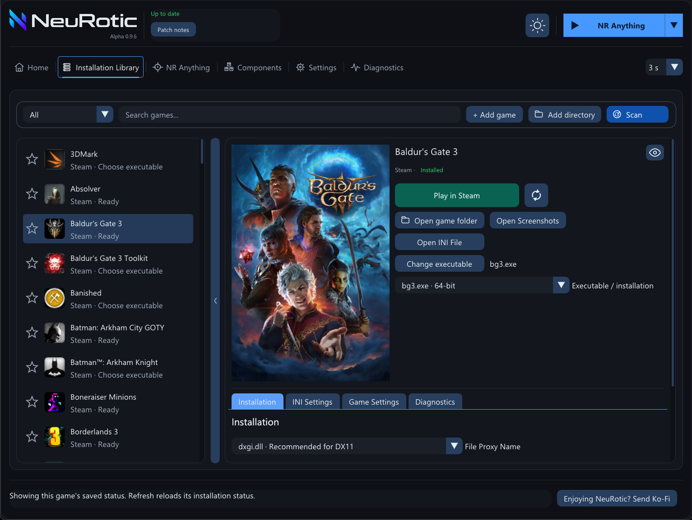](assets/library.png)

*Installation Library with Baldur’s Gate 3 selected.*

### NR Anything

NR Anything is an early-alpha tool for processing a selected desktop window. Controls include window selection, NR quality, detail and color strength, saved profiles, comparison modes, and PNG capture.

[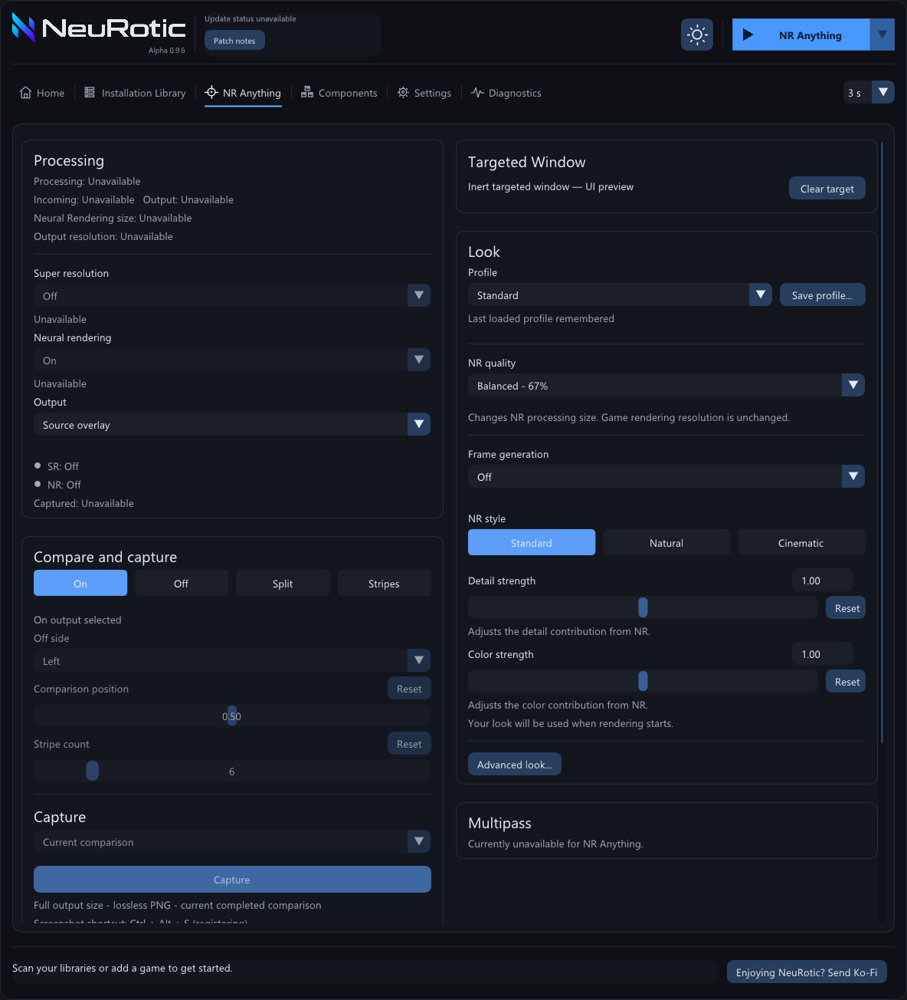](assets/anything-dark.png)

*NR Anything interface preview. Processing is inactive; settings shown are sample values.*

### DLSS Neural Rendering

The in-game menu provides model, detail, color, resolution, and style controls. Available options depend on the rendering path.

[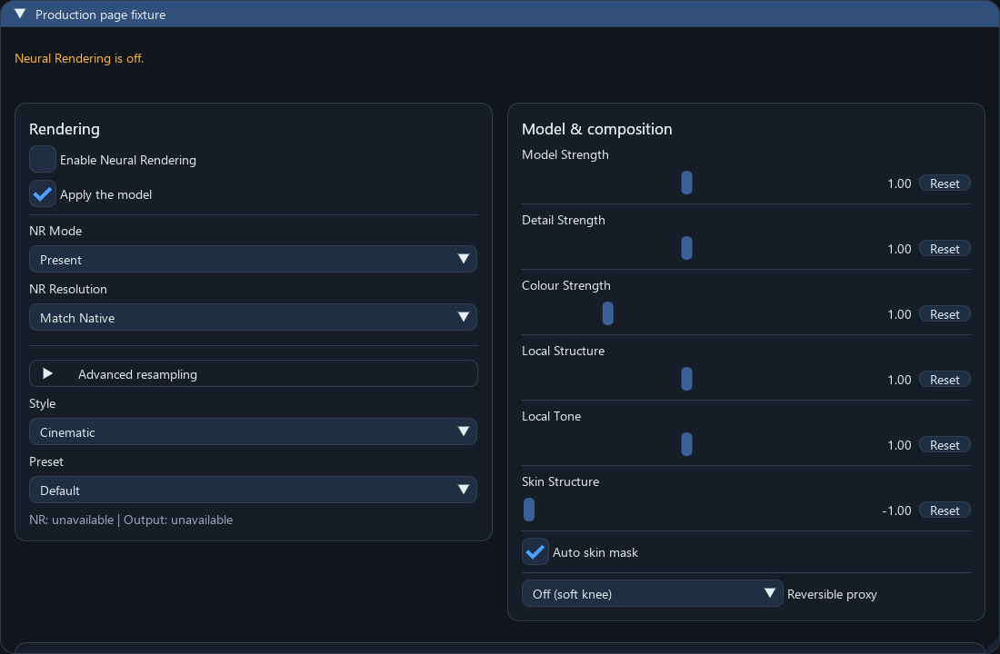](assets/neural-rendering.png)

*Neural-rendering controls with processing inactive.*

### Neural Rendering Advisor

The Advisor tests eligible Before- or After-upscaling routes using the current graphics path, available inputs, and selected processing resolution. It reports availability, observed timing, and reasons a route cannot run.

Recommendations use completed observations. Temporary analysis settings are restored after testing; applying a recommendation remains an explicit choice.

### Basic and Advanced Multipass

Basic Multipass provides shared controls for pass count, model strength, detail strength, and processing resolution. Advanced Multipass provides individual pass settings on supported routes.

Additional passes increase processing cost. Pass count and resolution control the workload; strength controls adjust the appearance.

### Rendering diagnostics

The in-game **Diagnostics → Rendering** panel displays rendering status, input availability, timing, and connections. It provides Refresh observations and Copy observation report actions. Detected inputs and inputs in use have separate indicators.

[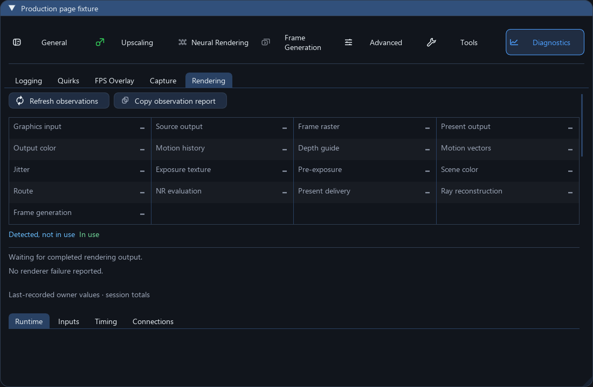](assets/rendering-diagnostics.png)

*Rendering diagnostics with no active rendering session.*

<strong>Additional interface screenshots</strong>

#### Installation progress

[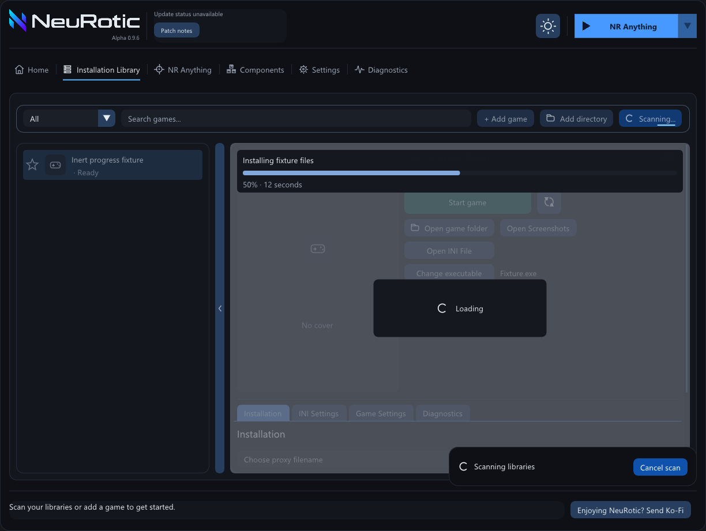](assets/installation-progress.png)

*Installation and scan progress with sample data.*

#### Light theme

[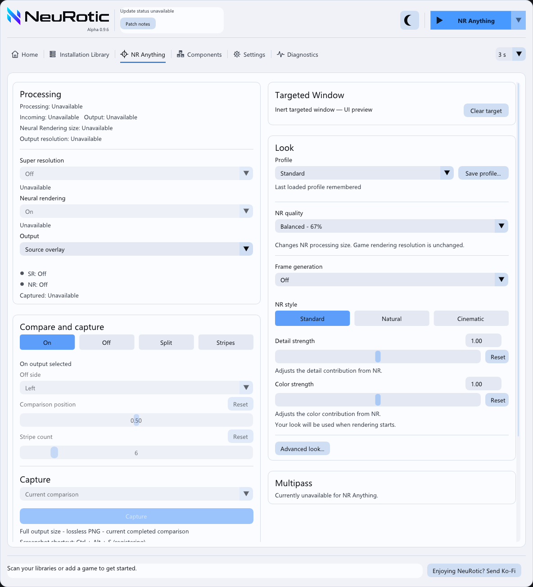](assets/anything-light.png)

*NR Anything interface preview in the light theme. Processing is inactive.*

#### Upscaling

[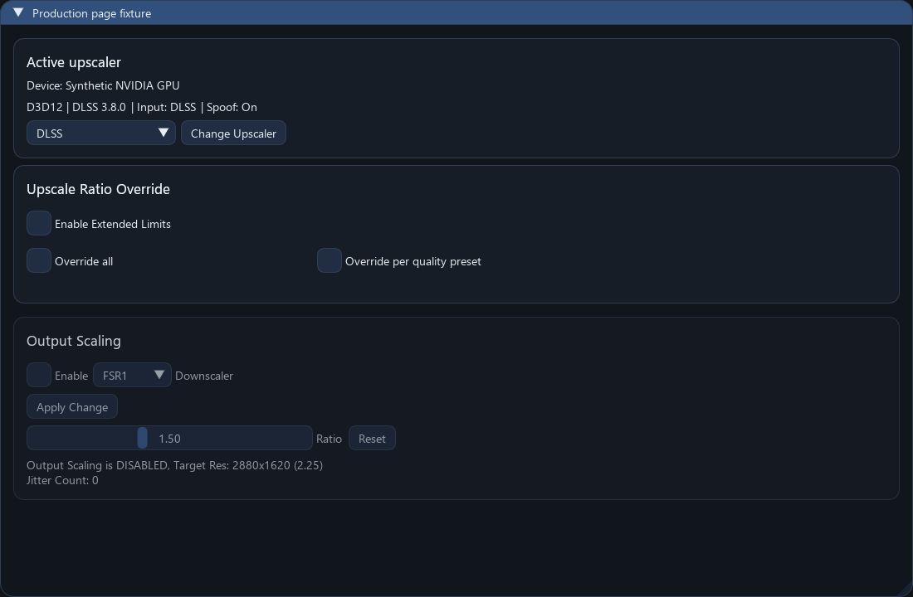](assets/upscaling.png)

*Upscaling controls with sample backend values.*

#### Multipass

[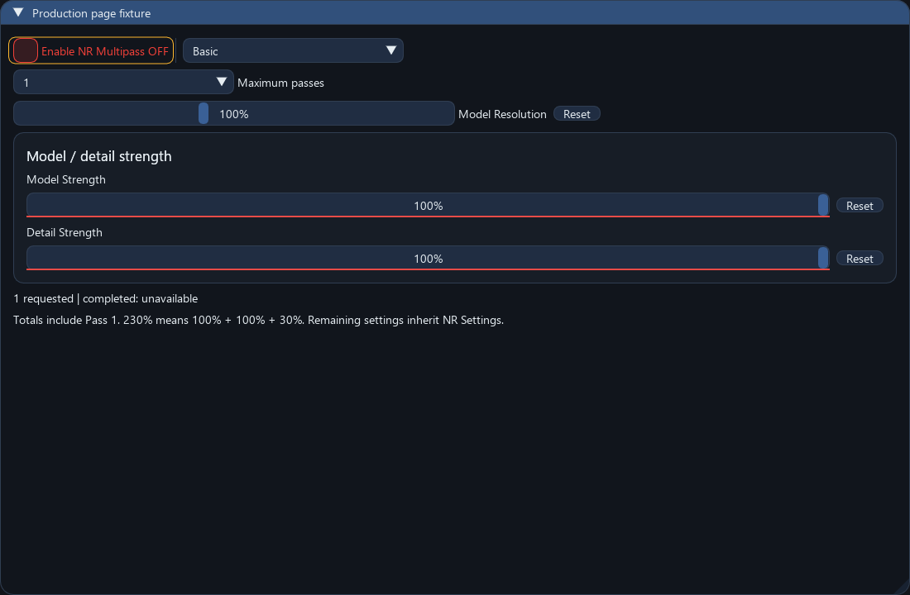](assets/multipass.png)

*Multipass settings. Processing is inactive.*

#### Input diagnostics

[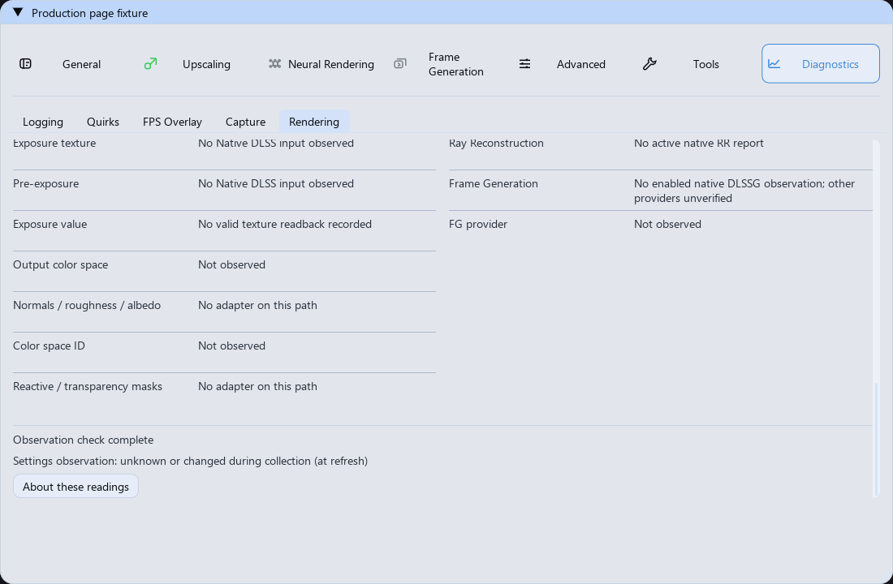](assets/input-diagnostics.png)

*Input diagnostics with no active rendering session.*

#### Translation editor

[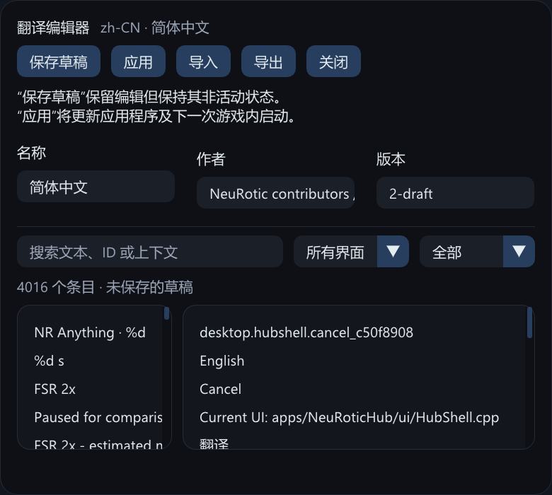](assets/language-editor.png)

*Translation editor with a sample Simplified Chinese language pack.*

#### Chinese interface

[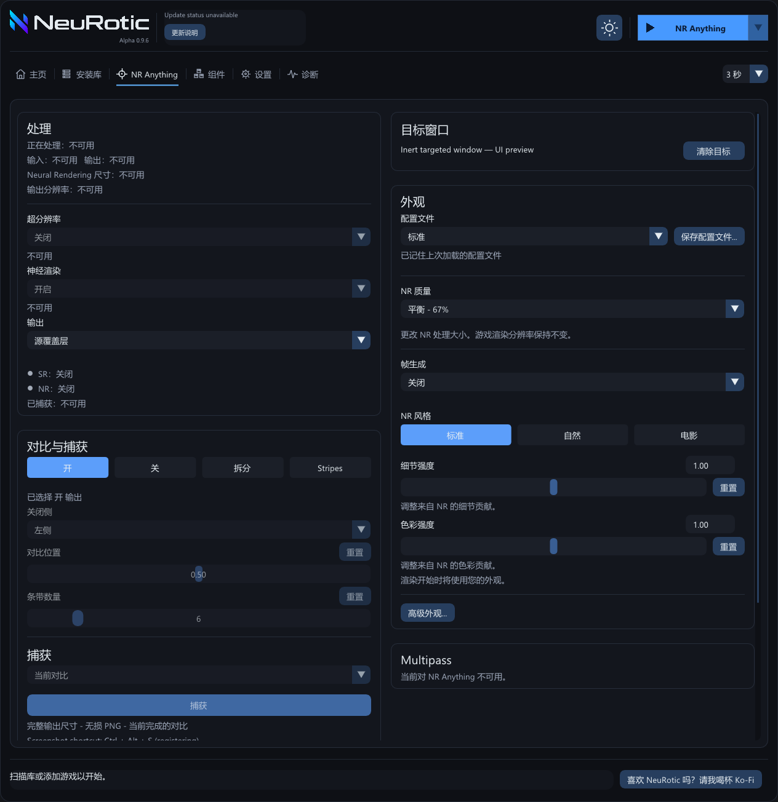](assets/anything-chinese.png)

*Simplified Chinese interface preview. Processing is inactive.*

[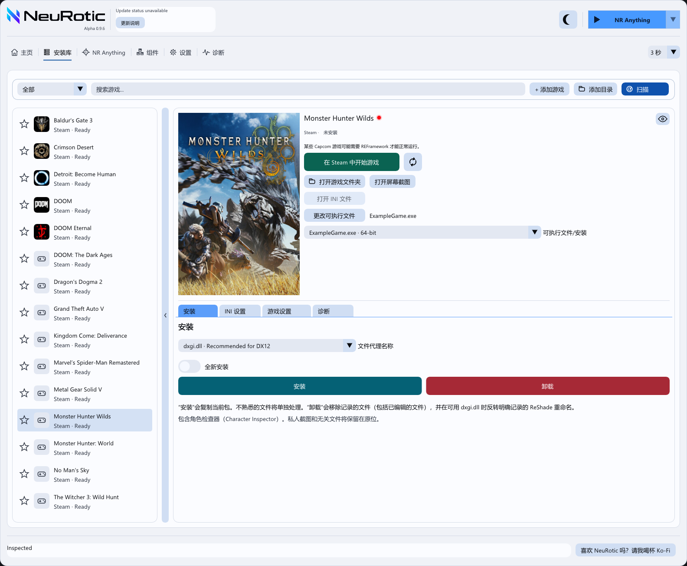](assets/library-chinese.png)

*Simplified Chinese Library in the light theme with sample game entries.*

## Workflows

| | NR Anything | In-game integration |
| --- | --- | --- |
| Processing | Captures and processes a selected desktop window. | Processes a supported rendering path inside the game. |
| Setup | Select a window in the desktop App. | Select the game's executable in the Library and install. |
| Controls | Quality, visual profiles, detail and color strength, comparison, capture, Start/Stop. | Applicable neural rendering, upscaling, frame-generation settings, and diagnostics. |
| Inputs | Captured window pixels. | Game inputs and guides available to the selected route. |

Comparison modes include original, processed, Split, and Stripes. Captures save PNG images of the selected comparison view.

## Compatibility

Rendering support depends on the game, executable architecture, graphics API, GPU, driver, and provider files.

Supported in-game NR routes can work without a native DLSS integration. Reported tests include Vulkan rendering in Detroit: Become Human without DLSS and DirectX 11 Present rendering in Borderlands 3. Compatible capture routes can acquire available depth and motion guides without native DLSS inputs. See the [reported game tests](RELEASE_NOTES.md#reported-game-tests) for the current list and game-specific notes. Frame-generation availability is separate from neural-rendering compatibility.

- Neural rendering requires a supported NVIDIA GPU and compatible user-supplied NR model.
- DirectX and Vulkan support depend on the selected integration route. Support for one game or route does not guarantee support for another.
- In-game installation requires matching executable and package architectures. Renaming a DLL does not resolve a 32-bit/64-bit mismatch. Use **NR Anything** when compatible in-game integration is unavailable.
- NR Anything captures SDR window images. It does not receive native game depth or motion vectors through window capture.
- Desktop super resolution, frame generation, Multipass, and depth estimation are unavailable in this package. In-game SR and FG controls depend on the active backend.
- Interface languages include English, Simplified Chinese, Japanese, Korean, German, French, Spanish, Portuguese (Brazil), Polish, and Russian. Translations are complete across the supported languages.
- Anti-cheat compatibility is not guaranteed. Check the game's rules before using modifications, especially online.

## Current Status and Roadmap

| Area | Current status |
| --- | --- |
| DirectX 12 Native Temporal | Available on compatible game paths |
| DirectX 11 through the DirectX 12 bridge | Available on supported paths; game-dependent |
| Vulkan Native and Present | Available on supported paths |
| HDR and Ray Reconstruction combinations | Supported combinations depend on the route |
| Basic and Advanced Multipass | Available on compatible Native and Present paths; additional passes increase cost |
| Native RTX 40 MFG | Available on supported DirectX 12 paths within provider limits |
| RTX 20/30 MFG | Opt-in experimental compatibility |
| Desktop NR Anything | Early-alpha window neural rendering; desktop upscaling and FG remain future work |
| Community languages | Completed included translations, with pack editing, import, and export |

Development priorities for future updates:

- Lower Multipass processing cost and improve control over quality and frame rate.
- Expand frame generation across more games, applications, and hardware, using available depth and motion data where supported.
- Add desktop upscaling and frame generation to NR Anything, including DLSS and FSR options where applicable.
- Make input capture more customizable and develop compatible routes for older graphics APIs and 32-bit games.
- Improve motion clarity, temporal stability, and direct color adjustment in Native Temporal.
- Integrate upscaling and neural rendering into a more consistent workflow.
- Explore processing weights for specific objects.
- Complete light-mode coverage and improve contrast and control styling.

See the [feature report](RELEASE_NOTES.md#planned-improvements) for more detail.

## Installation

Download the complete installer bundle from the [NeuRotic releases page](https://github.com/MagicalPrincessUnicorn/NeuRotic-an-OptiScaler-DLSSNR-fork/releases/tag/alpha-0.9.7). GitHub's automatic source archives are not installation packages.

### Desktop App

1. Extract the complete bundle outside the game directory and open `NeuRotic.exe`.
2. In **Components**, open the NR model folder and supply your compatible `nvngx_dlssnr.dll`. Add matching Streamline files when the selected rendering path needs them.
3. Fully close the game.
4. Open **Installation Library** to discover games, scan a selected directory, or add the game's real executable manually.
5. Select the executable and an appropriate proxy filename, then choose **Install**. Resolve any existing-file choices and wait for the result.
6. Adjust the per-game INI settings if needed, launch the game, and press **Insert** to open the in-game menu unless you have saved another shortcut.

For desktop window processing, open **NR Anything**, select a window directly or by countdown, and set the quality and visual controls. Select Start to process it and Stop to end processing.

### Getting the NVIDIA Model

The compatible NVIDIA model `nvngx_dlssnr.dll` is user-supplied and is not bundled. Add it through the App's component folder; the installer copies accepted supplied components into the selected game's installation.

NeuRotic's `nvngx.dll_dlssnr.dll` is a forwarder, not the NVIDIA model. Keep the complete bundled App, worker, and forwarder together.

### Manual Setup

The bundle includes `NeuRotic-Manual-Setup.cmd`. Close the game, run the script, and select its real executable. Follow the proxy and file-conflict choices shown by Setup.

### Existing Files and ReShade

Installation handles unfamiliar files individually. Recognized ReShade installations can offer a recorded coexistence rename where supported. Select the appropriate proxy for the game's graphics mode; renaming a DLL does not resolve an executable/package architecture mismatch.

## Uninstallation

1. Fully close the game.
2. Copy any game INI or model files you want to retain before removing the installation.
3. Select the game in **Installation Library** and choose **Uninstall**. Alternatively, run `NeuRotic-Manual-Uninstall.cmd` from the bundle or `Uninstall NeuRotic.cmd` from the game directory.
4. Read the removal result and any remaining-file notes.

Uninstall removes files recorded as installed by NeuRotic, including recorded settings and supplied components. A recorded ReShade rename is reversed when the original filename is available.

## Help Shape NeuRotic

When reporting a problem, compare separate game starts with:

- **NeuRotic unloaded:** the middleware is not loaded.
- **NeuRotic loaded, NR off:** the middleware is loaded with neural rendering disabled.
- **NeuRotic loaded, NR on:** neural rendering is enabled.

Include which conditions you tested, the game, build ID, graphics API, GPU and driver, settings, and relevant logs or screenshots. An issue with NR disabled can still involve loaded middleware; keep those observations in the report.

For NeuRotic-specific bugs, compatibility results, ideas, logs, screenshots, and wonderfully strange edge cases, join the [RenoDX Discord](https://discord.gg/Ce9bQHQrSV) and let me know how it is holding up.

## Support NeuRotic

If NeuRotic has improved a game for you and you would like to help support its continued development and longevity, you can:

- [Support me on Ko-fi](https://ko-fi.com/espiownage)
- [Star the NeuRotic repository](https://github.com/MagicalPrincessUnicorn/NeuRotic-an-OptiScaler-DLSSNR-fork)
- Share the project
- Test new releases and provide useful feedback
- Join the [RenoDX Discord](https://discord.gg/Ce9bQHQrSV)

Any support is deeply appreciated, but never a requirement.

## Credits and Attribution

Contributor, community-supporter, and upstream-project acknowledgments are collected on the separate [Credits and attribution page](ATTRIBUTION.md). It includes the original Special Thanks contributors and the sources of adapted code, libraries, fonts, and graphics components.

## Source, Credits, and Licensing

- [NeuRotic releases](https://github.com/MagicalPrincessUnicorn/NeuRotic-an-OptiScaler-DLSSNR-fork/releases/tag/alpha-0.9.7)
- [Official OptiScaler](https://github.com/optiscaler/OptiScaler)
- [Parent OptiScaler DLSS-NR fork](https://github.com/Dagherbou/OptiScaler_DLSSNR)

Review [LICENSE](LICENSE), [third-party notices](THIRD_PARTY_NOTICES.md), and the parent projects for original authorship, attribution, and licensing.
